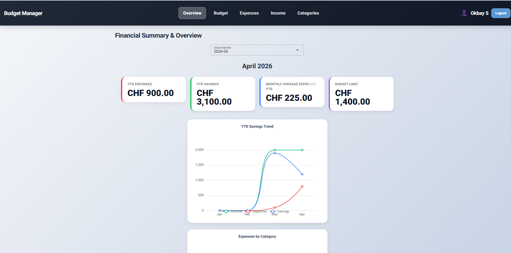
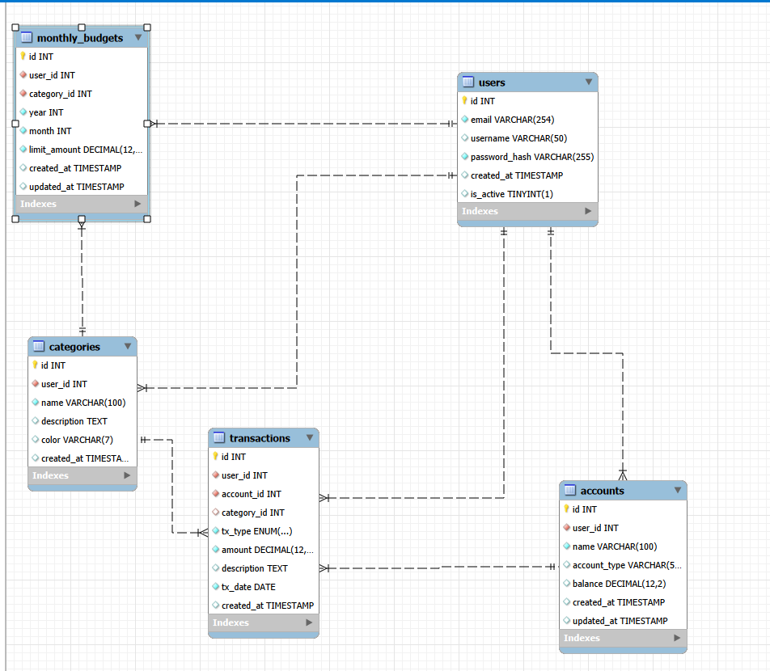
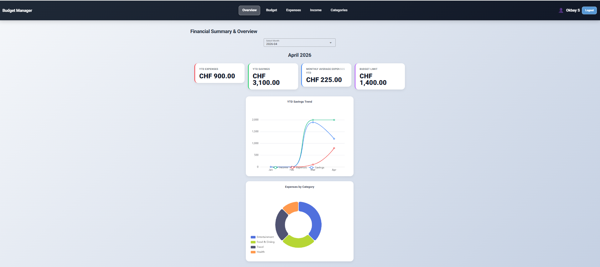
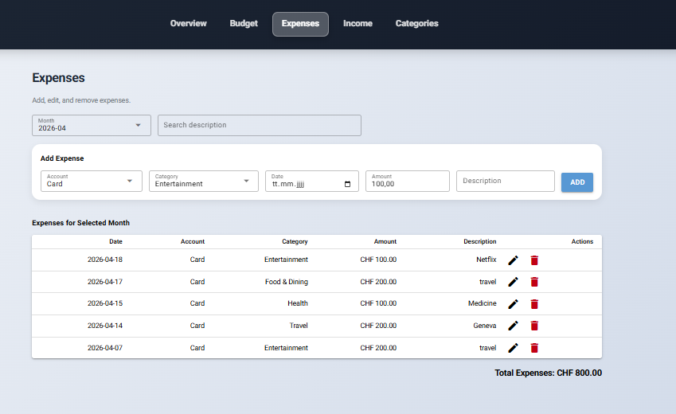
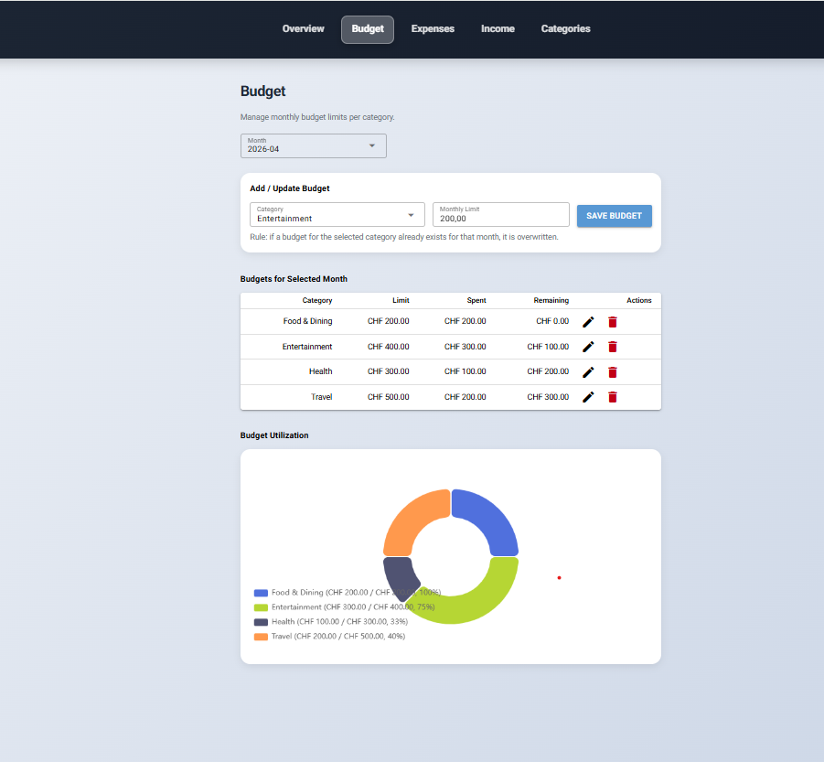

# 💰 Smart Budget Manager – Personal Finance Browser App



---

This project demonstrates the development of a browser-based personal finance application using **NiceGUI**, focusing on clean architecture, data validation, and database integration.

It aims to:

- Cover the full process from **requirements analysis to implementation**
- Apply advanced **Python** concepts in a web-based application
- Demonstrate **data validation**, layered architecture, and ORM-style database access
- Produce clean, maintainable, and well-tested code
- Support **teamwork and professional documentation**

---

## 📝 Application Requirements

### Problem

Managing personal finances manually is error-prone and time-consuming. Tracking expenses, income, budgets, and account balances across multiple accounts leads to inconsistencies and missed overspending.

---

### Scenario

The application allows users to:
- register and log in securely
- create named accounts (e.g. Bank, Cash)
- add, edit, and delete expense and income transactions
- define monthly spending budgets per category
- view a dashboard with YTD KPIs and charts
- manage custom categories

---

## 📖 User Stories

### 1. User Registration & Login
**As a user, I want to register and log in so that my data is private.**

- **Inputs:** username (`str`), password (`str`)
- **Outputs:** authenticated session, personalised dashboard

---

### 2. Manage Accounts
**As a user, I want to create named accounts to organise my money.**

- **Inputs:** account name (`str`)
- **Outputs:** updated account list

---

### 3. Record Transactions
**As a user, I want to add, edit, and delete expense and income transactions.**

- **Inputs:** amount (`float`), category, account, date (`date`), description (`str`)
- **Outputs:** filterable transaction list for the selected month

---

### 4. Budget Tracking
**As a user, I want to set monthly spending limits per category and see how much I have used.**

- **Inputs:** category, limit amount (`float`), month/year
- **Outputs:** budget table with spent vs limit per category, budget utilisation donut chart

---

### 5. Analytics Dashboard
**As a user, I want to see financial KPIs and charts for a selected month.**

- **Inputs:** month selector
- **Outputs:** YTD expenses, YTD savings, monthly average expenses, total budget limit; YTD income/expenses/savings trend line chart; expenses by category donut chart

---

## 🧩 Use Cases

### Main Use Cases
- Register / Login (User)
- Manage Accounts (User)
- Record Expense / Income (User)
- Set & Monitor Budgets (User)
- View Analytics Dashboard (User)

### Actors
- Registered User

---

---

## 🏛️ Architecture

### Layers
- **UI:** NiceGUI (browser-based interface)
- **Application logic:** controllers and services
- **Persistence:** SQLite + custom repositories + data access layer

### Design Decisions
- MVC structure (Model–View–Controller)
- Clear separation of concerns
- Business logic independent of UI

### Patterns Used
- MVC
- Repository / DAO
- Factory (transaction creation)
- Strategy (validation rules)
- Service Layer


---

## 🗄️ Database

The application uses a **SQLite** database managed via a custom `Db` class and repository classes.

### Entities
- `User`
- `Account`
- `Category`
- `Transaction`
- `Budget`

### Relationships
- One `User` → many `Account`, `Category`, `Transaction`, `Budget`
- One `Transaction` → one `Account` + one `Category`
- One `Budget` → one `Category`



---

## ✅ Project Requirements

1. Using NiceGUI for building an interactive web app
2. Data validation in the app
3. Using an ORM or database access layer for database management

---

### 1. Browser-based App (NiceGUI)

The application runs entirely in the browser. Users can:

- Register and log in
- Manage accounts and categories
- Add, edit, and delete transactions
- Set and track monthly budgets
- View a financial analytics dashboard

**Architecture note:** the browser is a thin client; UI state and business logic live on the server-side NiceGUI app.

---

### 2. Data Validation

All user input is validated before being persisted. Validation covers:
- Amounts must be positive numbers
- Required fields (account, category, description) must not be empty
- Budget limits must be non-negative
- Duplicate account/category names are rejected
- Password and username length requirements on registration

---

### 3. Database Management

All data is managed via a custom repository layer (`data_access/`) backed by SQLite. This provides clean separation between domain logic and persistence.

---

## ⚙️ Implementation

### Technology

- Python 3.13
- NiceGUI
- SQLite (via custom `Db` + repositories)
- pytest

---

### 📚 Libraries Used

- **nicegui** – UI framework
- **fastapi** – underlying web server (NiceGUI dependency)

---

## 📂 Repository Structure

```text
smart_budget_manager/
├── __init__.py
├── __main__.py
├── application.py
├── data_access/
│   ├── __init__.py
│   ├── db.py
│   ├── repositories.py
│   └── seed.py
├── domain/
│   ├── __init__.py
│   ├── exceptions.py
│   ├── models.py
│   ├── repositories.py
│   ├── store.py
│   ├── transaction_entities.py
│   └── validators.py
├── services/
│   ├── __init__.py
│   ├── analytics_service.py
│   ├── auth_service.py
│   └── budget_service.py
└── app/
    ├── __init__.py
    └── ui/
        ├── __init__.py
        ├── controllers.py
        ├── layout.py
        ├── pages_auth.py
        ├── pages_budget.py
        ├── pages_categories.py
        ├── pages_dashboard.py
        ├── pages_expenses.py
        ├── pages_income.py
        └── utils.py
```

---

## 🚀 How to Run

### 1. Project Setup
- Python 3.13 is required
- Create and activate a virtual environment:
   - **macOS/Linux:**
      ```bash
      python3 -m venv .venv
      source .venv/bin/activate
      ```
   - **Windows:**
      ```bash
      python -m venv .venv
      .venv\Scripts\Activate.ps1
      ```
- Install dependencies:
   ```bash
   pip install -r requirements.txt
   ```

### 2. Launch
```bash
python -m smart_budget_manager
```
Open the URL printed in the console (default: http://localhost:8080).

### 3. Usage

**Register & Login:**
1. Open the app in your browser.
2. Register a new account with a username and password.
3. Log in to access your personal dashboard.

**Record a Transaction:**
1. Navigate to **Expenses** or **Income**.
2. Select an account and category, enter the amount and description.
3. Submit — the transaction appears in the filtered list for the selected month.

**Set a Budget:**
1. Navigate to **Budgets**.
2. Choose a category and set a monthly spending limit.
3. The Budgets page shows a table of spent vs limit per category and a utilisation donut chart.

**View Analytics:**
1. Navigate to the **Dashboard**.
2. Select a month to see YTD KPI cards, a savings trend line chart (income/expenses/savings), and an expenses-by-category donut chart.




---

## 🧪 Testing

**Test mix:**
- 49 tests total
- Unit tests: domain models, validators, transaction entities, exception hierarchy
- DB tests: repository CRUD operations, schema creation, seeding
- Integration tests: full workflows (register → create accounts → record transactions → verify analytics + user isolation)

**To run tests:**
```bash
cd MVP10_Complete_Application
python test.py
```

**Template for writing test cases:**
1. Test case ID – unique identifier (e.g., TC_001)
2. Test case title/description – What is the test about?
3. Preconditions: Requirements before executing the test
4. Test steps: Actions to perform
5. Test data/input
6. Expected result
7. Actual result
8. Status – pass or fail
9. Comments – Additional notes or defect found

---

## 👥 Team & Contributions


---

## 📝 License

This project is for **educational use only** as part of the Advanced Programming module.


